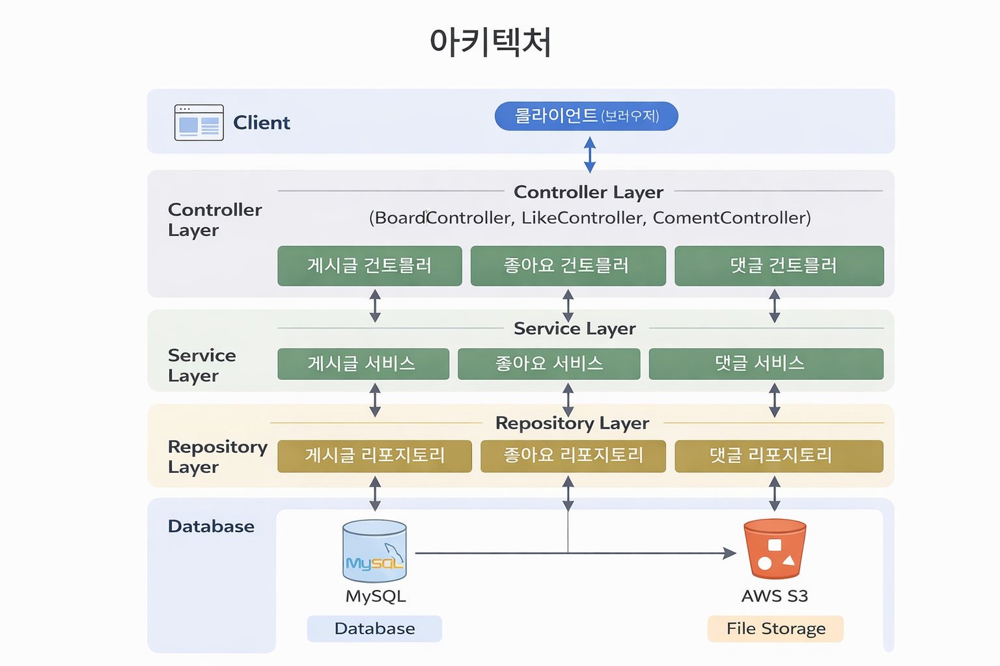

# 게시판 웹 애플리케이션

Spring MVC 기반의 게시판 웹 애플리케이션입니다.  
회원가입 및 로그인, 게시글 CRUD, 댓글 및 좋아요 기능을 제공하며  
레이어드 아키텍처를 적용해 역할을 분리하고 유지보수성을 고려해 설계했습니다.

---

## 주요 기능
- 회원가입 / 로그인 (Spring Security)
- 게시글 CRUD
- 댓글 기능
- 좋아요 기능 (중복 방지 처리)
- 이미지 업로드 및 AWS S3 저장
- 입력값 유효성 검증

---

## 기술 스택
- **Backend**: Java 17, Spring Boot, Spring MVC, Spring Security, JPA
- **Frontend**: Thymeleaf, HTML, CSS, JavaScript
- **Database**: MySQL
- **Infra**: AWS S3

---

## 아키텍처
Spring MVC 기반의 레이어드 아키텍처로  
Controller, Service, Repository 계층을 분리하여  
유지보수성과 테스트 용이성을 확보했습니다.



---

## 문제 해결 경험

### 좋아요 중복 처리
- **문제**: 동일 사용자가 하나의 게시글에 여러 번 좋아요를 누를 수 있는 문제 발생
- **원인**: 클라이언트 단 제어만으로는 중복 요청을 완전히 방지할 수 없음
- **해결**:
  - Service 계층에서 좋아요 존재 여부를 사전에 조회
  - DB 레벨에서 유니크 제약 조건을 적용해 중복 데이터 저장 방지
- **결과**: 동시 요청 상황에서도 좋아요 중복 발생 방지

👉 관련 코드: `LikeService`, `LikeRepository`

---

## 실행 방법

1. 프로젝트 클론
```bash
git clone https://github.com/your-id/your-repo.git
```
2. 환경 설정
- MySQL DB 설정
- AWS S3 Access Key / Secret Key 설정
3. 실행
```bash
./gradlew bootRun
```
---

## 배운 점

- 레이어드 아키텍처 기반의 책임 분리 설계 경험
- Service 계층에서 비즈니스 로직을 검증하는 중요성
- 중복 요청 및 예외 상황을 고려한 서버 중심 설계 경험
